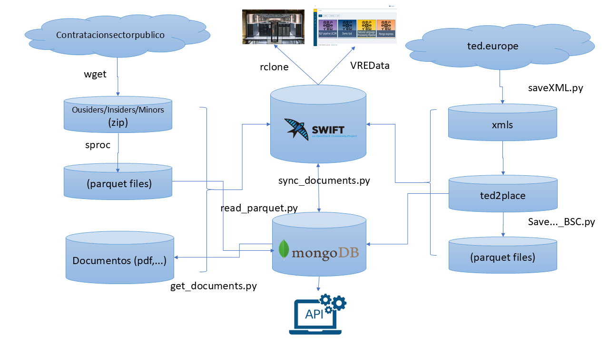

# ETLScripts
Scripts to populate NextProcurement Databases and Data Lake

## Name
NextProcurement ETL scripts suite

## Description
Suite of scripts to complete the population of NextProcurement Data Lake and DataBase. Information is processed from downloads from Contratactiones del Estado. Parquet files are produced using sproc by UC3M (https://github.com/nextprocurement/sproc)

## Requirements
    jupyter==1.0.0
    pandas==1.4.3
    pyarrow==8.0.0
    pymongo==4.1.1
    requests==2.28.0
    yaml==0.0.25
    python-swiftclient==4.0.1
    bs4==4.12.2
    dnspython==2.2.1
    unidecode==1.3.7

## Usage

### read_parquet.py
Read parquet files into mongodb DB

    usage: read_parquet.py [-h] [--drop] [--config CONFIG] [--debug] [-v]   --group GROUP [--update] codes_file pkt_file

    Parse NextProcurement parquets

    positional arguments:
        codes_file       Column sanitized names
        pkt_file         Parquet file

    options:
        -h, --help       show this help message and exit
        --drop           Clean MongoDB collection
        --config CONFIG  Configuration file
        --debug          Add Debug information
        -v, --verbose    Add Extra information
        --group GROUP    outsiders|minors|insiders
        --update         update existing atom or insert a new one

### get_documents.py
Script to load inlined documents onto data_lake, takes input data from MongoDB

    usage: get_documents.py [-h] [-v] [--replace] [--ini INI] [--fin FIN] [--id ID] [--where {disk,gridfs,swift}] [--folder FOLDER] [--config CONFIG] [--debug] [--scan_only] [--delay DELAY] [--container] [--allow_redirects] [--skip_early]                           [--skip_bad_servers] [--group GROUP]

    Download documents from found URLs

    options:
        -h, --help show this help message and exit
        --replace Replace existing files
        --ini INI Initial document range
        --fin FIN Final document range
        --id ID Selected document id
        --where {disk,gridfs,swift} Selected storage (disk|gridfs|swift)
        --folder FOLDER Selected Disk/Swift folder
        --config CONFIG Configuration file (default:secrets.yml)
        -v, --verbose Extra progress information
        --debug Extra debug information
        --scan_only Scan URL for doc type, do not download (implies --debug)
        --delay DELAY Time delay between requests to same server
        --container Swift container to use
        --allow_redirects Allow for automatic redirects on HTTP 301 302
        --skip_early Skip immediately if any file for the corresponding field is already stored
        --skip_bad_servers Skip servers with usual timeouts or missing documents to speed up
        --group GROUP insiders|outsiders|minors

### sync_documents.py
Script to synchronize documents among storages

    usage: sync_documents.py [-h] [--ini INI] [--fin FIN] [--id ID] [-i FOLDER_IN] [-o FOLDER_OUT] [--config CONFIG] [--delete] [--replace] [-v] [--debug] [--check_only]

    Sync documents between storages

    options:
        -h, --help            show this help message and exit
        --ini INI             Initial document range
        --fin FIN             Final document range
        --id ID               Selected document id
        -i FOLDER_IN, --folder_in FOLDER_IN
                        Selected Origin (local folder|gridfs:|container@swift:folder)
        -o FOLDER_OUT, --folder_out FOLDER_OUT
                        Selected Destination (local folder|gridfs:|container@swift:folder)
        --config CONFIG       Configuration file (default;secrets.yml)
        --delete              Delete files at destination that are not present at Origin
        --replace             Replace existing files
        -v, --verbose         Extra progress information
        --debug               Extra debug information
        --check_only          Check only, no transfer

### Other scripts
- *calc_summary.py* Collect summary data for API /info endpoint
- *clean_place.py* Mark obsolete and final document versions
- *refresh_versions.py* Mark obsolete versions
- *purge_documents.py* Remove duplicated documents from data lake
- *parse_bsc_companies.py* Parse company names and Ids extracted from documents
- *checking folder* Scripts for internal checks
- *scripts* Scripts to manage automation

## Authors and acknowledgment

Josep LL. Gelpí

## License
Relesead under the Apache 2.0 license

## Project status
In development
